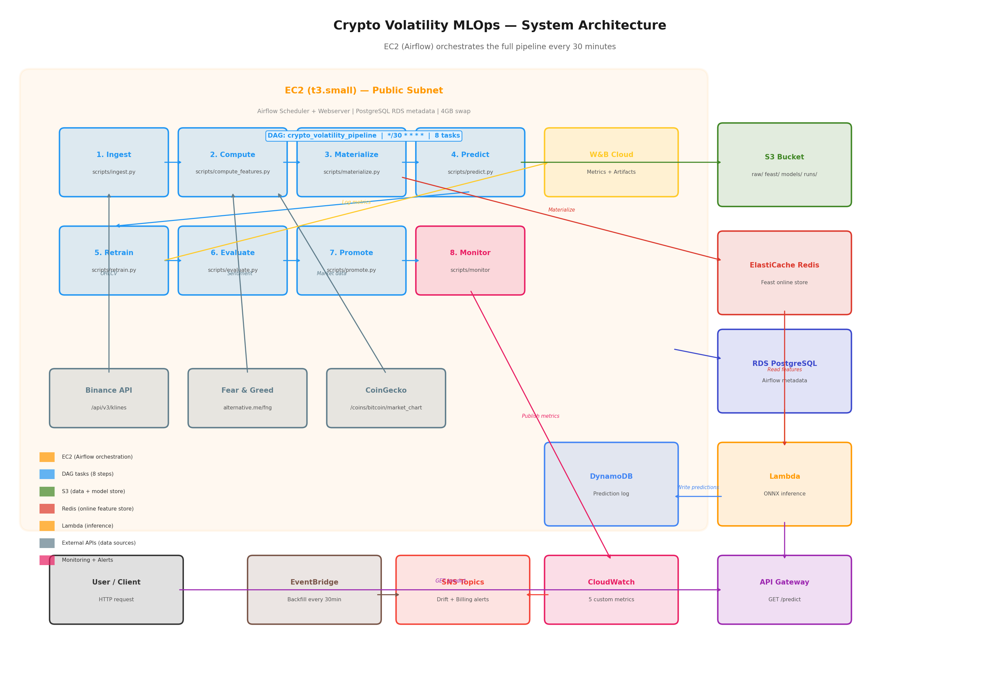

# Crypto Volatility MLOps

End-to-end MLOps pipeline that predicts BTC price volatility using XGBoost, served via AWS Lambda, orchestrated by Apache Airflow on EC2.

The pipeline runs every 30 minutes: ingest data from Binance, compute 15 features, train/evaluate models with champion/challenger promotion, serve predictions via API Gateway, and monitor for drift.

## Architecture



See [docs/architecture.md](docs/architecture.md) for full details.

## Prerequisites

| Tool | Version | Purpose |
|------|---------|---------|
| AWS CLI | v2+ | AWS resource management |
| Terraform | v1.5+ | Infrastructure provisioning |
| Docker | 20+ | Lambda container images, local dev |
| Python | 3.11+ | Pipeline code |
| Git | 2.x | Version control |

AWS account requirements:
- IAM user with admin access (or scoped to EC2, RDS, ElastiCache, Lambda, S3, DynamoDB, CloudWatch, SNS, API Gateway, ECR)
- An existing EC2 key pair in your target region
- Free tier eligible (most resources use t3.micro/small)

## Quick Start (Local Development)

Test the pipeline locally with Docker Compose before deploying to AWS:

```bash
# 1. Clone the repo
git clone <repo-url>
cd crypto_volatility_mlops

# 2. Initialize Airflow database (first time only)
docker compose --profile init up airflow-init

# 3. Start all services
docker compose up -d

# 4. Open Airflow UI
open http://localhost:8080    # username: admin, password: admin
```

This starts PostgreSQL (Airflow metadata), Redis (Feast online store), and Airflow (scheduler + webserver) — mirroring the production AWS topology.

## AWS Deployment

### Step 1: Configure Variables

```bash
# Create terraform.tfvars
cat > infra/terraform.tfvars << 'EOF'
aws_region   = "us-east-1"
alert_email  = "your-email@example.com"
ec2_key_name = "your-keypair-name"
db_password  = "a-strong-password-here"
EOF
```

### Step 2: Create .env File

```bash
cat > .env << 'EOF'
WANDB_API_KEY=your-wandb-api-key-here
S3_BUCKET=will-be-filled-after-terraform
REDIS_HOST=will-be-filled-after-terraform
EOF
```

Get your W&B API key from https://wandb.ai/settings under API Keys.

### Step 3: Spin Up Infrastructure

```bash
bash scripts/spin_up.sh
```

This runs Terraform in the correct order:
1. Billing alarm (SNS email — confirm the subscription when prompted)
2. Network (VPC, subnets, security groups, VPC endpoints)
3. Storage (S3 bucket, DynamoDB table, ECR repository)
4. Push stub Lambda image to ECR
5. Compute (EC2, RDS, ElastiCache) + Serverless (Lambda, API Gateway)

After completion, note the outputs:
```
ec2_public_ip       = "x.x.x.x"
s3_bucket_name      = "crypto-vol-data-xxxxxxxx"
redis_endpoint      = "crypto-vol-redis.xxxxx.cache.amazonaws.com"
api_gateway_url     = "https://xxxxx.execute-api.us-east-1.amazonaws.com/"
```

### Step 4: Set Up Airflow on EC2

SSH into the EC2 instance and run these commands:

```bash
ssh -i your-key.pem ec2-user@<ec2_public_ip>

# Install Python and dependencies
sudo dnf install -y python3.11 python3.11-pip
pip3.11 install apache-airflow==2.10.4 \
    xgboost scikit-learn onnxmltools skl2onnx onnxruntime \
    feast[redis,aws] wandb boto3 requests pandas pyarrow

# Create Airflow directories
sudo mkdir -p /opt/airflow/{dags,logs}
sudo chown -R ec2-user:ec2-user /opt/airflow

# Clone/copy the project
cd /home/ec2-user
git clone <repo-url> crypto_volatility_mlops
# OR: upload via S3
# aws s3 cp s3://<bucket>/deploy/code_update.tar.gz /tmp/ && tar xzf /tmp/code_update.tar.gz

# Render Airflow environment file
cat > /opt/airflow/airflow.env << EOF
AIRFLOW_HOME=/opt/airflow
AIRFLOW__CORE__EXECUTOR=LocalExecutor
AIRFLOW__CORE__SQL_ALCHEMY_CONN=postgresql+psycopg2://airflow:<db_password>@<rds_endpoint>:5432/airflow
AIRFLOW__CORE__DAGS_FOLDER=/opt/airflow/dags
AIRFLOW__CORE__LOAD_EXAMPLES=False
AIRFLOW__WEBSERVER__WEB_SERVER_PORT=8080
AIRFLOW__SCHEDULER__CATCHUP_BY_DEFAULT=False
PROJECT_ROOT=/home/ec2-user/crypto_volatility_mlops
S3_BUCKET=<s3_bucket_name>
REDIS_HOST=<redis_endpoint>
REDIS_PORT=6379
PREDICTIONS_TABLE_NAME=crypto-vol-predictions
WANDB_API_KEY=<your-wandb-key>
API_GATEWAY_URL=<api_gateway_url>
EOF

# Initialize Airflow database
export AIRFLOW_HOME=/opt/airflow
airflow db init
airflow users create \
    --username admin --password <choose-a-password> \
    --firstname Admin --lastname User \
    --role Admin --email admin@example.com

# Copy DAG and systemd services
cp crypto_volatility_mlops/dags/crypto_volatility_dag.py /opt/airflow/dags/
sudo cp crypto_volatility_mlops/infra/airflow/airflow-*.service /etc/systemd/system/

# Create .env with API keys
cat > /home/ec2-user/crypto_volatility_mlops/.env << EOF
WANDB_API_KEY=<your-wandb-key>
S3_BUCKET=<s3_bucket_name>
REDIS_HOST=<redis_endpoint>
FEAST_S3_BUCKET=<s3_bucket_name>
EOF

# Register Feast feature definitions
export FEAST_S3_BUCKET=<s3_bucket_name>
export REDIS_HOST=<redis_endpoint>
export REDIS_PORT=6379
bash crypto_volatility_mlops/scripts/feast_setup.sh

# Start Airflow
sudo systemctl daemon-reload
sudo systemctl enable airflow-scheduler airflow-webserver
sudo systemctl start airflow-scheduler airflow-webserver
```

### Step 5: Verify

1. **Airflow UI**: Open `http://<ec2_public_ip>:8080` (admin / your-password)
2. **Check DAG**: `crypto_volatility_pipeline` should appear and start running every 30 minutes
3. **First run**: The ingest task will backfill 90 days of Binance data on first run (~2 min)
4. **API**: `curl https://<api_gateway_url>/health` should return 200
5. **W&B**: Check https://wandb.ai for training metrics after the first retrain task completes

## Tear Down

```bash
bash scripts/tear_down.sh
```

This runs `terraform destroy` and audits for orphaned resources.

## Project Structure

```
crypto_volatility_mlops/
  dags/                        # Airflow DAG definition
    crypto_volatility_dag.py   # 8-task pipeline (runs every 30 min)
  src/
    ingestion/                 # Data ingestion from Binance
    features/                  # Feature computation, labels, Feast store
    monitoring/                # Drift detection, accuracy, alerts, retrain trigger
  training/
    train.py                   # GridSearchCV + XGBoost + ONNX export + W&B
    registry.py                # Champion/challenger model promotion
    smoke_test.py              # ONNX validation
  serving/
    app/main.py                # Lambda handler (ONNX inference)
    Dockerfile                 # Predictor Lambda image
  feast/
    features.py                # Feast feature view definitions
    feature_store.yaml         # Feast config (S3 + Redis)
  infra/
    main.tf                    # Terraform root module
    modules/                   # network, compute, serverless, storage, billing
    airflow/                   # Systemd service files + env template
  scripts/
    spin_up.sh                 # Full infra deployment
    tear_down.sh               # Full infra teardown
    ingest.py                  # Airflow task: data ingestion
    compute_features.py        # Airflow task: feature engineering
    materialize.py             # Airflow task: Feast S3 -> Redis
    predict.py                 # Airflow task: invoke Lambda
    retrain.py                 # Airflow task: model training
    evaluate.py                # Airflow task: champion vs challenger
    promote.py                 # Airflow task: model promotion
  docs/
    architecture.md            # System architecture reference
    feature_calculations.md    # Feature engineering reference
    chart_*.png                # Presentation charts
```

## Key Design Decisions

- **EC2 over MWAA**: Self-hosted Airflow at $15/month vs $350+ for managed
- **LocalExecutor**: Tasks run as subprocesses on EC2 — no Celery/Kubernetes needed
- **Champion/Challenger**: New models only promote if F1 improves — prevents regression
- **Feast (S3 + Redis)**: Offline store for training, online store for serving — single feature definition
- **ONNX export**: Framework-agnostic model format — Lambda doesn't need XGBoost installed
- **15-min candles**: Balances signal quality with data volume from Binance free API
- **scale_pos_weight**: Handles class imbalance (~63% CALM, ~37% VOLATILE)

## Monitoring

| Signal | Source | Purpose |
|--------|--------|---------|
| F1 / Accuracy / ROC AUC | W&B | Model quality tracking |
| Feature drift (KS-test) | CloudWatch | Detect distribution shifts |
| Rolling accuracy | DynamoDB + CloudWatch | Live prediction quality |
| Prediction latency | CloudWatch (Lambda Duration) | Serving performance |
| Billing alerts | SNS | Cost control ($1 threshold) |

## Cost Estimate (Monthly)

| Resource | Cost |
|----------|------|
| EC2 t3.small | ~$15 |
| RDS db.t3.micro | ~$15 |
| ElastiCache cache.t3.micro | ~$13 |
| Lambda (low volume) | < $1 |
| S3 + DynamoDB | < $1 |
| API Gateway | < $1 |
| **Total** | **~$45/month** |

Use `scripts/tear_down.sh` to destroy all resources when not in use.
